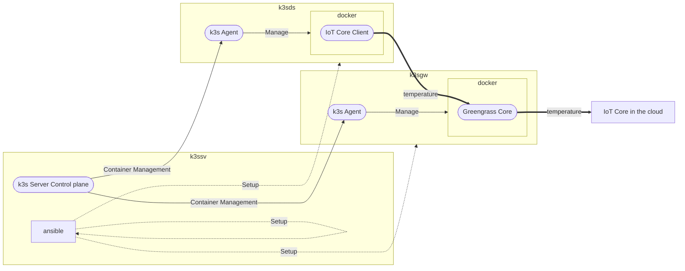

# Ansible

## 作るもののイメージ

- オフィスビルを管理し、ボイラーやビル空調設備などから温度・湿度・圧力・水漏れ・その他ビル管理の情報を吸い上げる
  - 簡単なシステムを構築
- データの吸い上げ
  - AWS Greengrassを使って構築してみる
  - Kubernetesを使って構築してみる
  - Amazon IoT Coreに格納する
  


## 今回の構成

- VMは手動で用意
- Ansibleを用意
- Kubernetesを用意
- 管理サーバということで、KubernetesのコントロールプレーンとAnsibleのサーバは１台で賄う
  - もちろん別々のほうが望ましいが集約する
    - PC台数減らしたい
    - どちらも管理ソフト
- ゲートウェイを１台設置
- ゲートウェイにデータを送るダウンストリームを１台設置

## 検証用VMの準備

検証では下記OSのVMを３台用意した

|Name|OS|Version|Type|Product|User|Address|
|-|-|-|-|-|-|-|
|k3ssv|Ubuntu| 22.04|server|arm64|opeadmin|10.211.55.24|
|k3sgw|Ubuntu| 22.04|server|arm64|opeadmin|10.211.55.25|
|k3sds|Ubuntu| 22.04|server|arm64|opeadmin|10.211.55.26|

## システム構成



## セットアップ

- VM用意する
- Ansibleをセットアップ
  - 手作業で行う
- Ansibleコントロールノードで、SSH公開鍵設定を行う
  - AnsibleでSSH接続設定
- AWS IoT Greengrass イメージを構築する
- Ansibleを実行する
  - k3s serverをセットアップ
  - k3s agentをセットアップ（ゲートウェイ用）
  - k3s agentをセットアップ（ダウンストリーム用）
  - ゲートウェイにGreengrassを導入
  - ダウンストリームにMQTTクライアント導入　　　　　← いまココ

opeadminは権限昇格可能にしておく。

https://www.shellhacks.com/ansible-sudo-a-password-is-required/

```sh
$ sudo visudo
# And append a line as follows:
opeadmin  ALL=(ALL) NOPASSWD:ALL
```

### Parallelsを使ったVMの準備

- Parallels Desktop で Ubuntu 22.04 Server を構築する
  - [Ubuntuのインストーラをダウンロード](https://ubuntu.com/download/server/arm)
  - opeadmin/passwordmk
  - parallels tools のインストールを選択。
    - mount -r -t iso9660 /dev/cdrom /media
    - cd /media
    - sudo ./install
    - sudo reboot

### Azureを使ったVMの準備

省略

### EC2を使ったVMの準備（未定稿）

ansibleでVMを３台作成する、その方法は

### Vagrantを使ったVMの準備

省略

## k3s Server(k3ssv)

Ansibleをインストールする。

```sh
# OpenSSH : SSHPass を利用する
sudo apt -y install sshpass

# Pythonインストール
opeadmin@k3ssv:~$ python3 --version
Python 3.10.12

opeadmin@k3ssv:~$ sudo apt install python3.10-venv

opeadmin@k3ssv:~$ mkdir workspace
opeadmin@k3ssv:~$ cd workspace/
opeadmin@k3ssv:~/workspace$ git clone -b k3s https://github.com/emboss369/2023-k8s-Team.git
Cloning into '2023-k8s-Team'...
remote: Enumerating objects: 7, done.
remote: Counting objects: 100% (7/7), done.
remote: Compressing objects: 100% (4/4), done.
remote: Total 7 (delta 0), reused 4 (delta 0), pack-reused 0
Receiving objects: 100% (7/7), done.
opeadmin@k3ssv:~/workspace$ cd 2023-k8s-Team/ansible/

opeadmin@k3ssv:~/workspace/2023-k8s-Team/ansible$ python3 -m venv k3s
opeadmin@k3ssv:~/workspace/2023-k8s-Team/ansible$ source k3s/bin/activate
# 以降、k3s環境で作業する
(k3s) ansible$ pip install pip --upgrade
(k3s) ansible$ pip install ansible==9.0.1
(k3s) ansible$ pip install stormssh
```

## Greengrassの構築

### Ansibleコントロールノードで、SSH公開鍵設定を行う

```playbook_ssh_authorize.yaml``` を ```-k``` 付きで実行する。

それ以降は公開鍵認証が使用できるようにする。

note: 事前にssh接続してfingerprintでyesを押しておくこと。

```sh
# 鍵の作成と配布
(k3s) opeadmin@k3ssv:ansible$ ansible-playbook -i inventory.yaml playbook_ssh_authorize.yaml -k
# 接続確認
(k3s) opeadmin@k3ssv:ansible$ ssh k3sgw hostname
k3sgw ←これが表示されること
(k3s) opeadmin@k3ssv:ansible$ ssh k3sds hostname
k3sds ←これが表示されること
```

### AWS IoT Greengrass イメージを構築する

[Document](https://docs.aws.amazon.com/ja_jp/greengrass/v2/developerguide/build-greengrass-dockerfile.html)

イメージの構築コマンド例を以下に示す。コマンドの詳細は[ドキュメント](https://docs.docker.com/)を参照。

作成したイメージは、Dockerリポジトリに配置しておく。

イメージ作成はVM上でなくともよい。今回はMacを使用した。

- 前提条件
  - Docker DesktopがインストールされているPCであること
    - Docker 4.19.0 (106363)
  - 今回検証した環境は Mac M1
    - 上記以外の環境では未検証

```sh
# awsからチェックアウト
git clone https://github.com/aws-greengrass/aws-greengrass-docker.git
cd aws-greengrass-docker
# バージョン指定
git checkout refs/tags/v2.5.3
# docker pullでローカルに取得する
docker pull --platform linux/amd64 amazonlinux:2
docker pull --platform linux/arm64/v8 amazonlinux:2
# ビルド
sudo docker build --platform linux/amd64 -t "amd64/aws-iot-greengrass:nucleus-version" ./
sudo docker build --platform linux/arm64/v8 -t "arm64/aws-iot-greengrass:nucleus-version" ./
# ログイン
docker login
# 任意の名前に変更
docker tag 973de5ff9ae9 emboss369/greengrass:2.5.3-amd64
docker tag 17dfd4d2e357 emboss369/greengrass:2.5.3-arm64
# 各プラットフォーム分をUpする
docker push emboss369/greengrass:2.5.3-arm64
docker push emboss369/greengrass:2.5.3-amd64 
# (オプション)マルチプラットフォーム対応する
docker manifest create emboss369/greengrass:2.5.3 emboss369/greengrass:2.5.3-amd64 emboss369/greengrass:2.5.3-arm64
docker manifest annotate --arch amd64 emboss369/greengrass:2.5.3 emboss369/greengrass:2.5.3-amd64
docker manifest annotate --arch arm64 emboss369/greengrass:2.5.3 emboss369/greengrass:2.5.3-arm64
docker manifest push emboss369/greengrass:2.5.3
```

### Ansibleの実行

```sh
# フォルダ移動
cd ~/workspace/2023-k8s-Team/ansible
# AWS_ACCESS_KEY_ID,AWS_SECRET_ACCESS_KEYをexport
export AWS_ACCESS_KEY_ID=<AWS_ACCESS_KEY_ID>
export AWS_SECRET_ACCESS_KEY=<AWS_SECRET_ACCESS_KEY>
# Ansible実行
(k3s) opeadmin@k3ssv:ansible$ ansible-playbook -i inventory.yaml playbook_k3s_server.yaml --private-key ~/.ssh/id_rsa_ansible

unreachable=0    failed=0 ← 最後のPLAY RECAPにこれが含まれていること
```
